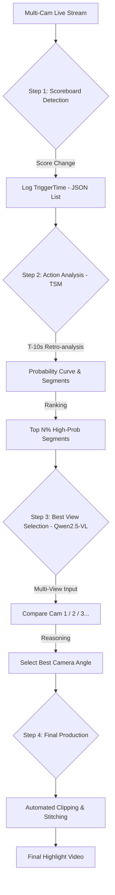

## Simulated Data Source

Backup data source: https://humansensinglab.github.io/basket-multiview/data.html

After downloading, you can do like this:

```bash
ffmpeg -framerate 25 -i %04d.png -c:v libx264 -pix_fmt yuv420p xxx.mp4
```

## Running 

```bash
cd script
bash pipeline.sh
```


